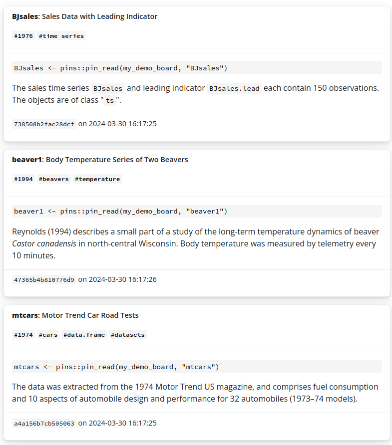

<!-- README.md is generated from README.Rmd. Please edit that file -->

# 📦 pinbrowser

<!-- badges: start -->

[](https://lifecycle.r-lib.org/articles/stages.html#experimental)
[](https://gardiners.r-universe.dev/pinbrowser)
[](https://github.com/gardiners/pinbrowser/actions/workflows/R-CMD-check.yaml)
<!-- badges: end -->

`pinbrowser` lets you interactively browse a board created with the
[pins](https://pins.rstudio.com/) package. It currently has one useful
function, `browse_board()`, which provides an RStudio viewer that allows
you to explore pins and their metadata.

## Installation

You can install the development version of pinbrowser from
[GitHub](https://github.com/) with:

``` r
# install.packages("devtools")
devtools::install_github("gardiners/pinbrowser")
```

## Example

Create a demo pin board and view its content in RStudio:

``` r
library(pinbrowser)

my_demo_board <- board_demo()
browse_board(my_demo_board)
```

<figure>

<figcaption aria-hidden="true">Screenshot of RStudio viewer containing
pin metadata.</figcaption>
</figure>
